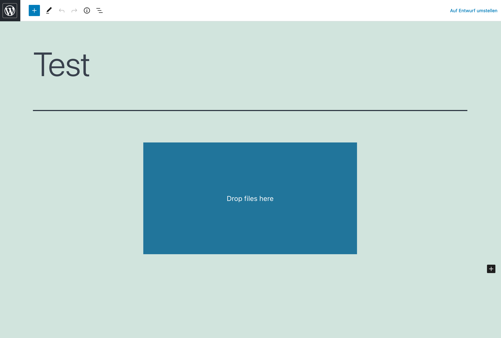

# Excel converter plugin
### Block Plugin for WordPress 
This WordPress plugin adds a Excel Converter Block to the Gutenberg editor. The Block enables the drag and drop conversion from XLS / XLSX files to an HTML table. 

<section>
  
   
   
</section>


## Building

To build this plugin, you have to have node and npm installed.

Run 
```sh
npm install
```
and
```sh
rpm run plugin-zip
```
This should result in a zip file in the root of this project. Now, the plugin can be installed via the upload function in WordPress.

## Maintainment

I wrote this plugin over the weekend for a teacher of mine who needed it for the website of my school, so I don't expect to maintain this. If you have any questions, feel free to message me, I will be happy to help. 